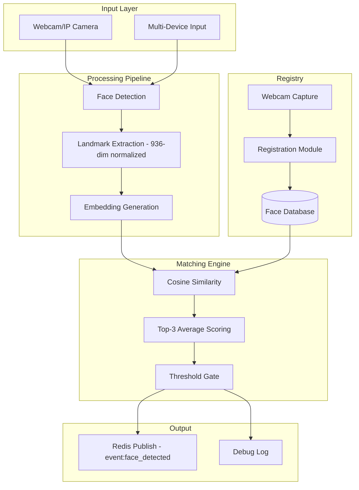

<div align="center">

# 🛡️ Lazarus Guard

**Face-recognition security system with real-time multi-device deployment**

Part of [Project Nexus](https://github.com/AyamGorengMadura/nexus-core)


</div>

---

## 📖 Overview

Lazarus Guard is a modular face-recognition security system built on 936-dimensional normalized facial landmark embeddings. It uses cosine similarity matching with averaged top-3 scoring for robust identification, designed for edge deployment across multiple devices.

## 🏗️ Architecture



## ✨ Features

- **936-Dimensional Embeddings** — Normalized facial landmark vectors via MediaPipe FaceLandmarker.
- **Cosine Similarity Matching** — Averaged top-3 scoring for noise-resilient identification.
- **Debounce & Cooldown** — Known faces publish once per state change; unknown faces are rate-limited (5s cooldown) to avoid event spam.
- **Webcam Registration** — Direct face enrollment from camera capture (press `S` during patrol).
- **Edge-Ready** — Lightweight enough for single-board computers and edge nodes.
- **Redis Event Bus** — Publishes detection events for consumption by [Nexus Core](https://github.com/AyamGorengMadura/nexus-core).

## 📂 Project Structure

```
lazarus-guard/
├── src/
│   ├── recognition/
│   │   └── main_guard.py    # Detection, embedding, matching, Redis publish
│   └── registry/              # Face database (per-person photo folders)
├── configs/                    # MediaPipe model files
└── requirements.txt
```

> A modular split (`api/`, `capture/`, `registry/` as separate CRUD layers) is planned — see Roadmap.

## 🛠️ Requirements

- Python 3.10+
- MediaPipe
- NumPy
- OpenCV
- Redis (running instance — see [nexus-core setup](https://github.com/AyamGorengMadura/nexus-core))

## 🚀 Quick Start

### 1. Clone Repository
```bash
git clone https://github.com/AyamGorengMadura/lazarus-guard.git
cd lazarus-guard
```

### 2. Setup Environment
```bash
pip install opencv-python mediapipe pillow pillow-heif redis --break-system-packages
```
> Or use a virtualenv: `python -m venv venv && source venv/bin/activate` before installing.

### 3. Register Faces
Place reference photos in `src/registry/<PersonName>/` (JPG, PNG, or HEIC), or use the in-app `S` key to capture directly from webcam during patrol.

### 4. Run
```bash
python3 src/recognition/main_guard.py
```
Requires a running Redis instance on `localhost:6379`.

## 🔌 Integration with Nexus (Current)

Lazarus Guard publishes face detection events to Redis via Pub/Sub (`event:face_detected`). [Nexus Core](https://github.com/AyamGorengMadura/nexus-core) subscribes to these events for identity resolution, trust-tier lookup, and context injection into the [Yuki Framework](https://github.com/AyamGorengMadura/nexus-core) narrator.

Event payload example:
```json
{"match": true, "name": "Satura", "confidence": 0.98, "embedding_id": "Satura"}
```

## 🗺️ Roadmap

- [ ] Refactor into modular structure (`src/api/`, `src/capture/`, `src/registry/` as CRUD layer)
- [ ] REST/gRPC API layer for external integrations
- [ ] Multi-face simultaneous detection
- [ ] Anti-spoofing (liveness detection)
- [ ] Edge deployment configs (Raspberry Pi, Jetson)
- [ ] Web dashboard for registry management
- [ ] Encrypted embedding storage

## 📄 License

Private — All rights reserved.
