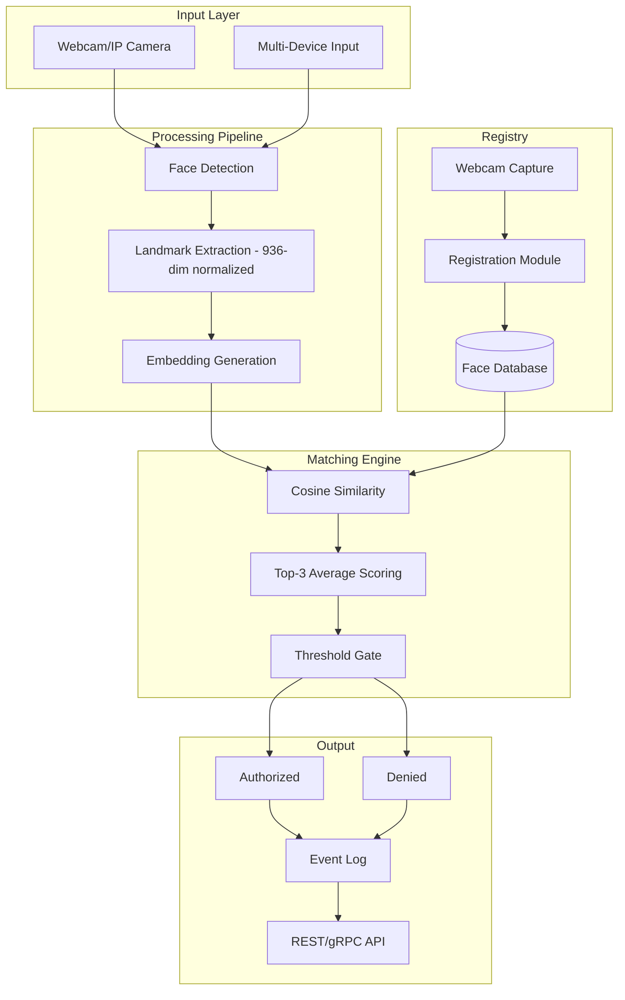

# 🛡️ Lazarus Guard

**Face-recognition security system with real-time multi-device deployment**

Part of [Project Nexus: Dozor](https://github.com/AyamGorengMadura/nexus-core)

---

## 📖 Overview

Lazarus Guard is a modular face-recognition security system built on 936-dimensional normalized facial landmark embeddings. It uses cosine similarity matching with averaged top-3 scoring for robust identification, designed for edge deployment across multiple devices.

## 🏗️ Architecture

✨ Features

    936-Dimensional Embeddings — Normalized facial landmark vectors via MediaPipe FaceLandmarker.

    Cosine Similarity Matching — Averaged top-3 scoring for noise-resilient identification.

    Multi-Device Support — Scaffolded directory structure for distributed deployment.

    Webcam Registration — Direct face enrollment from camera capture.

    Edge-Ready — Lightweight enough for single-board computers and edge nodes.

    Modular API — REST/gRPC interface for integration with Nexus orchestrator.

📂 Project Structure
Plaintext

lazarus-guard/
├── src/
│   ├── recognition/      # Embedding engine, cosine matching, top-3 scoring
│   ├── capture/          # Webcam & multi-device input handling
│   ├── registry/         # Face database CRUD, enrollment pipeline
│   └── api/              # REST/gRPC service layer
├── configs/              # Device configs, thresholds, model params
├── tests/                # Unit & integration tests
├── docs/                 # Technical documentation
├── scripts/              # Deployment & setup automation
├── requirements.txt
├── .env.example
└── README.md

🛠️ Requirements

    Python 3.10+

    MediaPipe

    NumPy

    OpenCV

🚀 Quick Start
1. Clone Repository
Bash

git clone [https://github.com/AyamGorengMadura/lazarus-guard.git](https://github.com/AyamGorengMadura/lazarus-guard.git)
cd lazarus-guard

2. Setup Environment
Bash

python -m venv .venv
source .venv/bin/activate
pip install -r requirements.txt

3. Configure Environment
Bash

cp .env.example .env
# Edit .env with your device/camera settings

4. Run Application
Bash

python -m src.api.main

🔌 Integration with Nexus

Lazarus Guard operates as a standalone service but is designed to be orchestrated by Nexus Core. Communication happens via REST API or gRPC, allowing Nexus to:

    Trigger scans on events (IoT sensors, schedules).

    Aggregate logs from multiple Lazarus instances.

    Route alerts to other Nexus services (Cyrene, notifications).

🗺️ Roadmap

    [ ] Multi-face simultaneous detection

    [ ] Anti-spoofing (liveness detection)

    [ ] Edge deployment configs (RPi, Jetson)

    [ ] Nexus Core integration protocol

    [ ] Web dashboard for registry management

    [ ] Encrypted embedding storage

📄 License

Private — All rights reserved.
